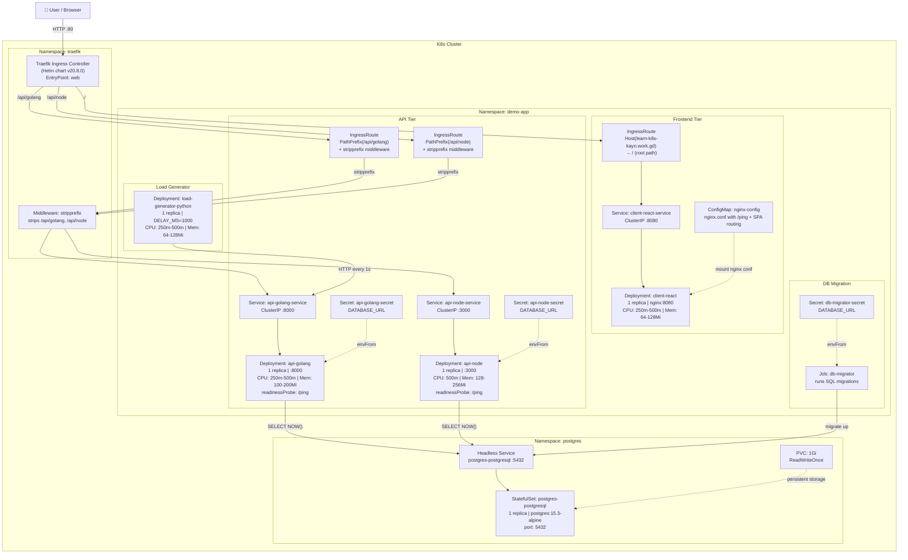

# K8s Architecture

## Overview

A **3-tier web application** deployed across 3 Kubernetes namespaces on host `learn-k8s-kayn.work.gd`.

- **Frontend:** React app served via Nginx
- **APIs:** Go (port 8000) and Node.js (port 3000), both query PostgreSQL
- **Database:** PostgreSQL 15.3 StatefulSet with persistent storage
- **Ingress:** Traefik with path-based routing and prefix stripping
- **Load Testing:** Python generator hitting the Go API every 1s

## Architecture Diagram



## Component Summary

| Component | Namespace | Kind | Port | Image |
|---|---|---|---|---|
| Traefik | `traefik` | Helm release | 80 | traefik/traefik v20.8.0 |
| client-react | `demo-app` | Deployment (1r) | 8080 | client-react-nginx:0.1.0 |
| api-golang | `demo-app` | Deployment (1r) | 8000 | api-golang:0.1.0 |
| api-node | `demo-app` | Deployment (1r) | 3000 | api-node:0.1.0 |
| load-generator | `demo-app` | Deployment (1r) | - | load-generator-python:0.1.0 |
| db-migrator | `demo-app` | Job | - | db-migrator:0.1.0 |
| PostgreSQL | `postgres` | StatefulSet (1r) | 5432 | postgres:15.3-alpine |

## Routing Rules

| Path | Target Service | Middleware |
|---|---|---|
| `/` | client-react-service:8080 | none |
| `/api/golang` | api-golang-service:8000 | stripprefix |
| `/api/node` | api-node-service:3000 | stripprefix |

## Cross-Namespace Communication

APIs and the db-migrator in `demo-app` connect to PostgreSQL in `postgres` namespace via FQDN:

```
postgres-postgresql-0.postgres-postgresql.postgres.svc.cluster.local:5432
```
